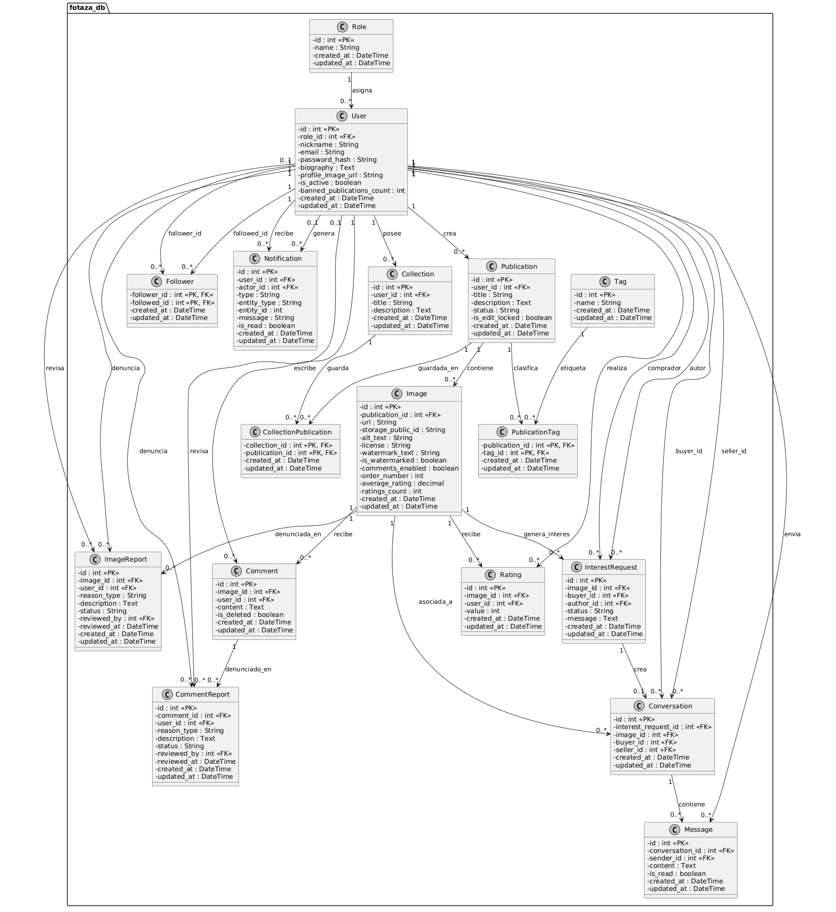

# Fotaza 2 - Trabajo Final Integrador Programación Web II

Fotaza 2 es una aplicación web de comunidad de fotografías desarrollada como Trabajo Final Integrador para Programación Web II.

La plataforma permite registrar usuarios, publicar fotografías, comentar, valorar imágenes, seguir usuarios, guardar publicaciones en colecciones, denunciar contenido, moderar publicaciones, buscar contenido con filtros avanzados y contactar al autor de una imagen mediante el sistema de "Me interesa" y mensajería privada.

## Tecnologías utilizadas

* Node.js
* Express
* PUG como motor de vistas del lado servidor
* MySQL
* Sequelize ORM
* Sequelize CLI
* JWT para autenticación
* Cookies HTTP para sesión
* Multer para carga de imágenes locales
* CSS personalizado

## Requisitos previos

Para ejecutar el proyecto localmente se necesita tener instalado:

* Node.js
* npm
* MySQL local, por ejemplo mediante XAMPP, WAMP, Laragon o una instalación propia de MySQL
* Git

## Instalación y ejecución local

El proyecto está preparado para poder ejecutarse siguiendo estos pasos.

### 1. Clonar el repositorio

```bash
git clone <URL_DEL_REPOSITORIO>
cd <NOMBRE_DEL_PROYECTO>
```

### 2. Instalar dependencias

```bash
npm install
```

### 3. Configurar variables de entorno

Crear un archivo `.env` en la raíz del proyecto tomando como base el archivo `.env.example`.

Ejemplo para ejecución local con XAMPP/MySQL usando usuario `root` sin contraseña:

```env
PORT=3000
NODE_ENV=development

DB_HOST=localhost
DB_PORT=3306
DB_NAME=fotaza_db
DB_USER=root
DB_PASSWORD=

JWT_SECRET=fotaza_secret_dev

CLOUDINARY_CLOUD_NAME=
CLOUDINARY_API_KEY=
CLOUDINARY_API_SECRET=
```

El archivo `.env.example` se incluye en el repositorio como referencia.

### 4. Inicializar la base de datos

```bash
npm run db:init
```

Este comando crea o verifica la base de datos configurada, ejecuta las migraciones y carga los datos iniciales de prueba.

La base local utilizada por defecto es:

```text
fotaza_db
```

Si se usa XAMPP con la configuración por defecto, no es necesario crear manualmente la base desde phpMyAdmin, ya que el script de inicialización se encarga de crearla si no existe.

### 5. Iniciar la aplicación

```bash
npm start
```

Una vez iniciado el servidor, la aplicación queda disponible en:

```text
http://localhost:3000
```

## Flujo de ejecución requerido para corrección

El proyecto puede ejecutarse siguiendo únicamente estos comandos y pasos:

```bash
npm install
```

```bash
npm run db:init
```

```bash
npm start
```

Antes de ejecutar `npm run db:init`, se debe configurar el archivo `.env` en la raíz del proyecto tomando como referencia `.env.example`.

## Scripts disponibles

```bash
npm start
```

Inicia el servidor en modo normal.

```bash
npm run dev
```

Inicia el servidor en modo desarrollo usando `node --watch`.

```bash
npm run db:init
```

Crea o verifica la base de datos, ejecuta migraciones y carga seeders.

```bash
npm run db:migrate
```

Ejecuta las migraciones pendientes.

```bash
npm run db:seed
```

Ejecuta los seeders pendientes.

```bash
npm run db:reset
```

Elimina las migraciones aplicadas, vuelve a migrar y vuelve a cargar los datos demo.
Este comando se recomienda solo para desarrollo.

## Usuarios de prueba

Todos los usuarios demo tienen la contraseña:

```text
123456
```

| Rol           | Email                                               | Uso                                  |
| ------------- | --------------------------------------------------- | ------------------------------------ |
| Administrador | [admin@fotaza.com](mailto:admin@fotaza.com)         | Acceso a moderación general          |
| Validador     | [validador@fotaza.com](mailto:validador@fotaza.com) | Acceso a moderación general          |
| Usuario       | [jonathan@fotaza.com](mailto:jonathan@fotaza.com)   | Usuario común con publicaciones demo |
| Usuario       | [camila@fotaza.com](mailto:camila@fotaza.com)       | Usuario común con publicaciones demo |

## Funcionalidades implementadas

### Autenticación

* Registro de usuarios.
* Inicio de sesión.
* Cierre de sesión.
* Sesión mediante JWT guardado en cookie.
* Roles de usuario: administrador, validador y usuario común.
* Protección de rutas privadas.
* Restricción de rutas según rol.

### Publicaciones e imágenes

* Creación de publicaciones.
* Carga de imágenes.
* Licencias de imagen: con copyright y sin copyright.
* Marca de agua opcional.
* Etiquetas por publicación.
* Visualización de publicaciones.
* Detalle de publicación.
* Los usuarios no autenticados solo ven imágenes sin copyright.

### Comentarios

* Los usuarios autenticados pueden comentar imágenes.
* El autor de la publicación puede cerrar o reabrir comentarios.
* Los comentarios eliminados por moderación no se muestran.
* Los usuarios no autenticados no pueden comentar.

### Valoraciones

* Los usuarios autenticados pueden valorar imágenes de otros usuarios.
* El autor no puede valorar sus propias imágenes.
* Cada usuario puede valorar una imagen una sola vez.
* Se calcula promedio de valoración y cantidad de votos.

### Seguidores

* Un usuario puede seguir a otro.
* Un usuario puede dejar de seguir a otro.
* No se permite seguirse a uno mismo.
* Perfil público con cantidad de seguidores, seguidos y publicaciones.
* Feed de usuarios seguidos.

### Notificaciones

* Notificaciones por comentarios.
* Notificaciones por valoraciones.
* Notificaciones por seguidores.
* Notificaciones por denuncias.
* Notificaciones por interés en imágenes.
* Notificaciones por mensajes privados.
* Contador de notificaciones no leídas en la navegación.
* Opción para marcar notificaciones como leídas.

### Colecciones y favoritos

* Creación de colecciones personales.
* Listado de colecciones del usuario.
* Guardado de publicaciones en colecciones.
* Eliminación de publicaciones guardadas.
* Prevención de duplicados dentro de una misma colección.

### Búsqueda avanzada

* Búsqueda por texto.
* Filtro por autor.
* Filtro por etiqueta.
* Filtro por licencia.
* Filtro por valoración mínima.
* Filtro por fecha desde y hasta.
* Respeta permisos de visualización para usuarios no autenticados.

### Denuncias de imágenes

* Los usuarios autenticados pueden denunciar imágenes de otros usuarios.
* No se permite denunciar imágenes propias.
* No se permite denunciar dos veces la misma imagen mientras la denuncia esté pendiente.
* La publicación queda bloqueada para edición cuando recibe denuncias.
* Al llegar al umbral configurado de denuncias, la publicación pasa a revisión.
* Administradores y validadores pueden revisar denuncias.
* Se puede desestimar una denuncia.
* Se puede dar de baja una publicación.
* El autor acumula publicaciones dadas de baja.
* Si un autor acumula demasiadas publicaciones dadas de baja, se desactiva su cuenta.

### Denuncias de comentarios

* Los usuarios autenticados pueden denunciar comentarios de otros usuarios.
* No se permite denunciar comentarios propios.
* El usuario que denunció puede cancelar su denuncia mientras esté pendiente.
* El autor de una publicación puede revisar denuncias sobre comentarios realizados en sus publicaciones.
* Administradores y validadores pueden revisar denuncias de comentarios.
* Se puede desestimar una denuncia.
* Se puede borrar un comentario denunciado.

### Moderación

* Panel de moderación para administradores y validadores.
* Revisión de publicaciones bajo denuncia.
* Desestimación de denuncias.
* Baja de publicaciones denunciadas.
* Registro del usuario que revisó la denuncia.
* Fecha de revisión de denuncia.

### Me interesa y mensajería privada

* Los usuarios pueden marcar interés en imágenes de otros usuarios.
* Se crea una solicitud de interés.
* Se crea una conversación privada entre interesado y autor.
* El interesado puede enviar un mensaje inicial.
* El autor recibe una notificación.
* Ambos usuarios pueden continuar la conversación.
* Cada usuario solo puede ver sus propias conversaciones.

## Estructura general del proyecto

```text
src/
  app.js
  config/
  database/
    migrations/
    models/
    seeders/
  middlewares/
  modules/
    auth/
    users/
    publications/
    comments/
    ratings/
    reports/
    moderation/
    followers/
    notifications/
    collections/
    search/
    interests/
    messages/

views/
  layouts/
  partials/
  auth/
  home/
  publications/
  users/
  collections/
  notifications/
  comments/
  moderation/
  search/
  messages/
  errors/

public/
  css/
  img/
  js/
  uploads/

docs/
  uml/
```

## Base de datos

El proyecto utiliza una base de datos relacional MySQL administrada mediante Sequelize.

La estructura incluye tablas para:

* roles
* usuarios
* publicaciones
* imágenes
* etiquetas
* relación publicación-etiqueta
* comentarios
* valoraciones
* seguidores
* notificaciones
* colecciones
* publicaciones guardadas en colecciones
* denuncias de imágenes
* denuncias de comentarios
* solicitudes de interés
* conversaciones
* mensajes privados

Las tablas utilizan claves primarias, claves foráneas, índices, restricciones de unicidad e integridad referencial.

## Diagrama UML / DER de la base de datos

El siguiente diagrama representa las principales tablas de la base de datos MySQL, sus claves primarias, claves foráneas y relaciones.



El archivo fuente del diagrama se encuentra en:

```text
docs/uml/uml-fotaza-2.puml
```

## Datos demo

El proyecto incluye seeders con datos de prueba:

* usuarios por rol
* publicaciones
* imágenes demo locales
* etiquetas
* comentarios
* valoraciones
* seguidores
* colecciones
* notificaciones

Las imágenes demo se encuentran en:

```text
public/img/
```

## Despliegue en Railway

El proyecto también fue probado en Railway utilizando:

* Servicio Web para la aplicación Node.js.
* Servicio MySQL para la base de datos.
* Variables de entorno configuradas desde el panel de Railway.

En producción, las variables utilizadas por Railway son equivalentes a:

```env
NODE_ENV=production

DB_HOST=<HOST_DE_MYSQL_EN_RAILWAY>
DB_PORT=<PUERTO_DE_MYSQL_EN_RAILWAY>
DB_NAME=<NOMBRE_DE_BASE_EN_RAILWAY>
DB_USER=<USUARIO_DE_MYSQL_EN_RAILWAY>
DB_PASSWORD=<PASSWORD_DE_MYSQL_EN_RAILWAY>

JWT_SECRET=<CLAVE_SECRETA_SEGURA>
```

También se soportan las variables generadas por Railway para MySQL:

```env
MYSQLHOST=
MYSQLPORT=
MYSQLUSER=
MYSQLPASSWORD=
MYSQLDATABASE=
```

La configuración del proyecto permite usar tanto variables `DB_*` como variables `MYSQL*`.

## Consideraciones importantes

* No se debe subir el archivo `.env` al repositorio.
* No se debe subir la carpeta `node_modules`.
* No se deben subir imágenes cargadas por usuarios dentro de `public/uploads`.
* El archivo `public/uploads/.gitkeep` sí se incluye para conservar la carpeta.
* Las imágenes subidas por usuarios se guardan localmente en `public/uploads`.
* En entornos cloud, como Railway, las imágenes subidas localmente pueden no persistir luego de redeploys si no se configura almacenamiento persistente.
* Las imágenes demo se usan solo para facilitar la corrección del proyecto.
* El proyecto usa renderizado del lado servidor con PUG.
* No utiliza React, Vue, Angular, Next, Nuxt ni Gatsby.

## Problemas encontrados y soluciones aplicadas

### Error por migraciones duplicadas

Durante el desarrollo, algunas migraciones fueron renombradas o reejecutadas mientras sus tablas ya existían. Esto podía generar errores como índices duplicados o tablas existentes.

Solución aplicada:

* Revisar la tabla `SequelizeMeta`.
* Usar `npm run db:reset` durante desarrollo.
* Evitar renombrar migraciones ya ejecutadas.

### Error por columnas inexistentes en seeders

Al crear datos demo aparecieron errores por columnas que no existían en la estructura final de la base, como `public_id` o `is_private`.

Solución aplicada:

* Ajustar el seeder para que coincida exactamente con las migraciones reales del proyecto.

### Bloqueo al dar de baja publicaciones

Al dar de baja publicaciones denunciadas, una notificación creada fuera de la transacción podía provocar que la operación quedara esperando.

Solución aplicada:

* Permitir que `createNotification` reciba una transacción.
* Ejecutar las notificaciones de moderación dentro de la misma transacción.

### Denuncias desestimadas que seguían apareciendo como activas

Después de desestimar una denuncia, el detalle de publicación seguía mostrando que el usuario ya había denunciado.

Solución aplicada:

* Filtrar denuncias por `status = 'pending'` al cargar publicaciones.
* Permitir reactivar denuncias desestimadas si el usuario vuelve a denunciar.

### Conexión a MySQL en Railway

Durante el despliegue, la aplicación necesitó utilizar las variables internas de Railway para conectarse al servicio MySQL.

Solución aplicada:

* Adaptar la configuración para leer variables `MYSQLHOST`, `MYSQLPORT`, `MYSQLUSER`, `MYSQLPASSWORD` y `MYSQLDATABASE`.
* Mantener compatibilidad con variables locales `DB_HOST`, `DB_PORT`, `DB_USER`, `DB_PASSWORD` y `DB_NAME`.

IMPORTANTE = En Railway, las imágenes subidas por usuarios se guardan localmente en public/uploads. Al no tener configurado un volumen persistente ni Cloudinary, esas imágenes pueden perderse si el servicio se reinicia o se redeploya. Las imágenes demo incluidas en public/img sí permanecen porque forman parte del repositorio. Se utilizará Cloudinary en el futuro para hacerlo más profesional :).

## Autor

Jonathan Muñoz

Trabajo Final Integrador - Programación Web II

